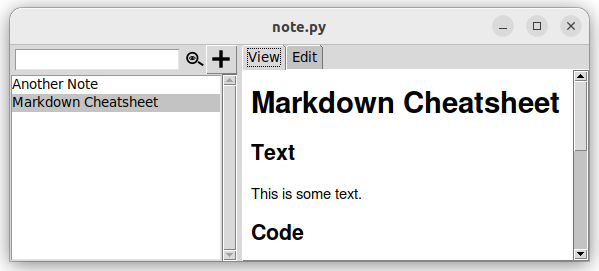
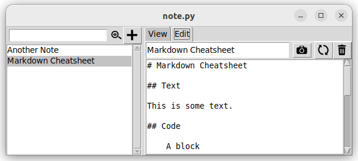

# note.py

[note.py](https://github.com/falk-werner/note.py) is yet another note taking app. It is aimed to be minimalistic and is shipped as a single python file.

## Features

`note.py` has two operation modes:

- **View mode** to view existing notes
- **Edit mode** to edit new or alter existing notes

You can switch between the two modes using tabs.

### View Mode

In `View mode` you can browse, filter and view existing notes.

### Edit Mode

In `Edit mode` you can create new notes or edit existing ones.

### Full Feature List

- create notes using markdown
- filter existing notes
- rename exsiting notes
- insert screenshots
- remove existing notes
- customize view using CSS

## Accelerators

There are some key bindings to speed up some tasks:

| Key Binding | Description |
| ----------- | ----------- |
| Ctrl + n    | Create a new note |
| Ctrl + d    | Delete selected note |
| Ctrl + s    | Sync changes _(note that changes are also saved automatically)_|
| Ctrl + b    | Browse attachments |
| Ctrl + p    | Create screenshot |
| Ctrl + q    | Quit |
| Ctrl + e    | Toggle between View and Edit |
| Ctrl + f    | Set focus on filter element |

## Customize View

You can customize the view using CSS. Therefore, just edit the file `$HOME/.notepy/style.css` as desired. To return to defaults, simply delete this file as `note.py` will re-create it during the next start.

## Under the hood

All notes managed by `note.py` are stored in the directory `$HOME/.notepy/notes`. There is a directory for each note according to the notes name. Each note has a file `note.md` containing the contents of the notes. Screenshots are also stored in the note directory.

There is also a central configuration file `$HOME/.notepy.yml` containing
some basic settings.

## Requirements

`note.py` runs on Python 3.

In order to run `note.py`, the following python modules should be installed:

- tkinter
- tkinter-tooltip
- tkinterweb
- ttkthemes
- Pillow
- pyyaml
- cmarkgfm

You can install these modules using the [requirements.txt](requirements.txt) file provided in this repository.

    pip install -r requirements.txt

In oder to create screenshots, [gnome-screenshot](https://linux.die.net/man/1/gnome-screenshot) has to be installed on the system.

## Other 3rd party stuff

- Icons are used from [https://icofont.com/](https://icofont.com/)  
  _(see [license agreement](https://icofont.com/license))_
